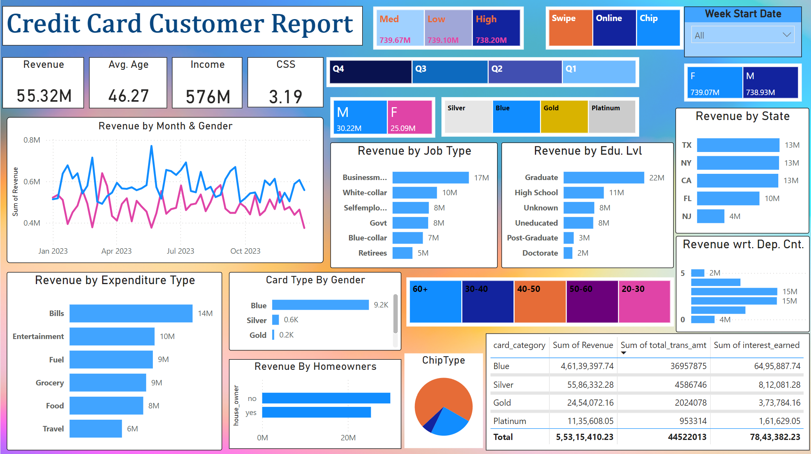
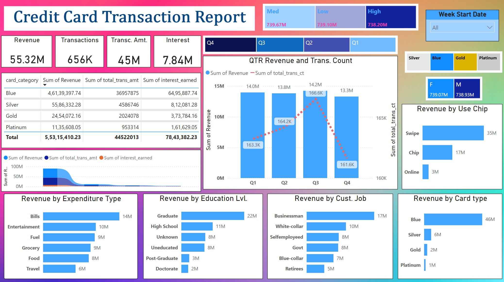

# Credit Card Transaction Dashboard

## Project Objective
To develop a comprehensive credit card weekly dashboard that provides real-time insights into key performance metrics and trends, enabling stakeholders to monitor and analyze credit card operations effectively.

## Table of Contents
- [Project Objective](#project-objective)
- [Import Data to SQL Database](#import-data-to-sql-database)
- [DAX Queries](#dax-queries)
- [Project Insights - Week 53 (31st Dec)](#project-insights)
- [Dashboard Images](#dashboard-images)

## Import Data to SQL Database

### Steps
1. **Prepare CSV files**:
   - `credit_card.csv`
   - `customer.csv`
   - `cust_add.csv` (for additional customer data to check real-time functionality)
   - `cc_add.csv` (for additional credit card data to check real-time functionality)

2. **Create tables in SQL**:
   ```sql
   CREATE TABLE cust_detail (
       customer_id SERIAL PRIMARY KEY,
       customer_name VARCHAR(100),
       customer_age INT,
       income FLOAT
   );

   CREATE TABLE cc_detail (
       transaction_id SERIAL PRIMARY KEY,
       customer_id INT,
       annual_fees FLOAT,
       total_trans_amt FLOAT,
       interest_earned FLOAT,
       week_start_date DATE,
       FOREIGN KEY (customer_id) REFERENCES cust_detail(customer_id)
   );
   ```

3. **Import CSV files into SQL**:
   ```sql
   COPY cust_detail(customer_id, customer_name, customer_age, income)
   FROM '/path/to/customer.csv' DELIMITER ',' CSV HEADER;

   COPY cc_detail(transaction_id, customer_id, annual_fees, total_trans_amt, interest_earned, week_start_date)
   FROM '/path/to/credit_card.csv' DELIMITER ',' CSV HEADER;
   ```

## DAX Queries

### Create AgeGroup Column
```dax
AgeGroup = SWITCH(
    TRUE(),
    'public cust_detail'[customer_age] < 30, "20-30",
    'public cust_detail'[customer_age] >= 30 && 'public cust_detail'[customer_age] < 40, "30-40",
    'public cust_detail'[customer_age] >= 40 && 'public cust_detail'[customer_age] < 50, "40-50",
    'public cust_detail'[customer_age] >= 50 && 'public cust_detail'[customer_age] < 60, "50-60",
    'public cust_detail'[customer_age] >= 60, "60+",
    "unknown"
)
```

### Create IncomeGroup Column
```dax
IncomeGroup = SWITCH(
    TRUE(), 
    'public cust_detail'[income] < 35000, "Low",
    'public cust_detail'[income] >= 35000 && 'public cust_detail'[income] < 70000, "Med",
    'public cust_detail'[income] >= 70000, "High",
    "unknown"
)
```

### Calculate Revenue
```dax
Revenue = 'public cc_detail'[annual_fees] + 'public cc_detail'[total_trans_amt] + 'public cc_detail'[interest_earned]
```

### Calculate Week Number
```dax
week_num2 = WEEKNUM('public cc_detail'[week_start_date])
```

### Current Week Revenue
```dax
Current_week_Revenue = CALCULATE(
    SUM('public cc_detail'[Revenue]),
    FILTER(
        ALL('public cc_detail'),
        'public cc_detail'[week_num2] = MAX('public cc_detail'[week_num2])
    )
)
```

### Previous Week Revenue
```dax
Previous_week_Revenue = CALCULATE(
    SUM('public cc_detail'[Revenue]),
    FILTER(
        ALL('public cc_detail'),
        'public cc_detail'[week_num2] = MAX('public cc_detail'[week_num2])-1
    )
)
```

## Project Insights
### Week over Week (WoW) Change
- Revenue increased by 28.8%
- Total Transaction Amount & Count increased by xx% & xx%
- Customer count increased by xx%

### Overview Year-to-Date (YTD)
- Overall revenue is 57M
- Total interest is 8M
- Total transaction amount is 46M
- Male customers are contributing more in revenue 31M, female 26M
- Blue & Silver credit cards are contributing to 93% of overall transactions
- TX, NY & CA are contributing to 68%
- Overall Activation rate is 57.5%
- Overall Delinquent rate is 6.06%

## Dashboard Images



## How to Run the Project
1. Clone the repository:
   ```bash
   git clone https://github.com/kartabaykrishna/PowerBI-CC-Dashboard.git
   ```

2. Set up the PostgreSQL database and import the data using the provided SQL scripts.

3. Open the Power BI dashboard file and connect it to the PostgreSQL database.

4. To test the real-time functionality, add data to the `cust_add.csv` and `cc_add.csv` files and import them into the database. Refresh the Power BI dashboard to see the updates.
#### `note` : if you want to interact and view the dashboard, please click [here](https://learnermanipal-my.sharepoint.com/:u:/g/personal/kartabya_krishna_learner_manipal_edu/EY3_zBSjOrhLnuQpCe0JytUBQL1yW3w3M6Qh9fGFWypa-Q?e=Xx0QiZ)
